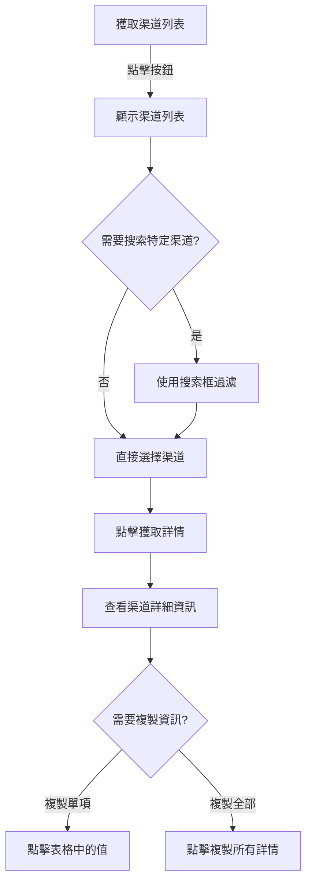
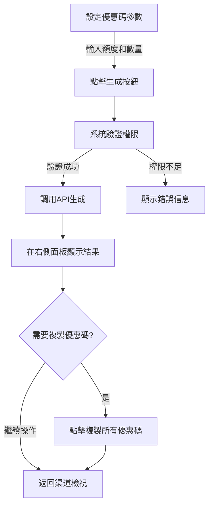
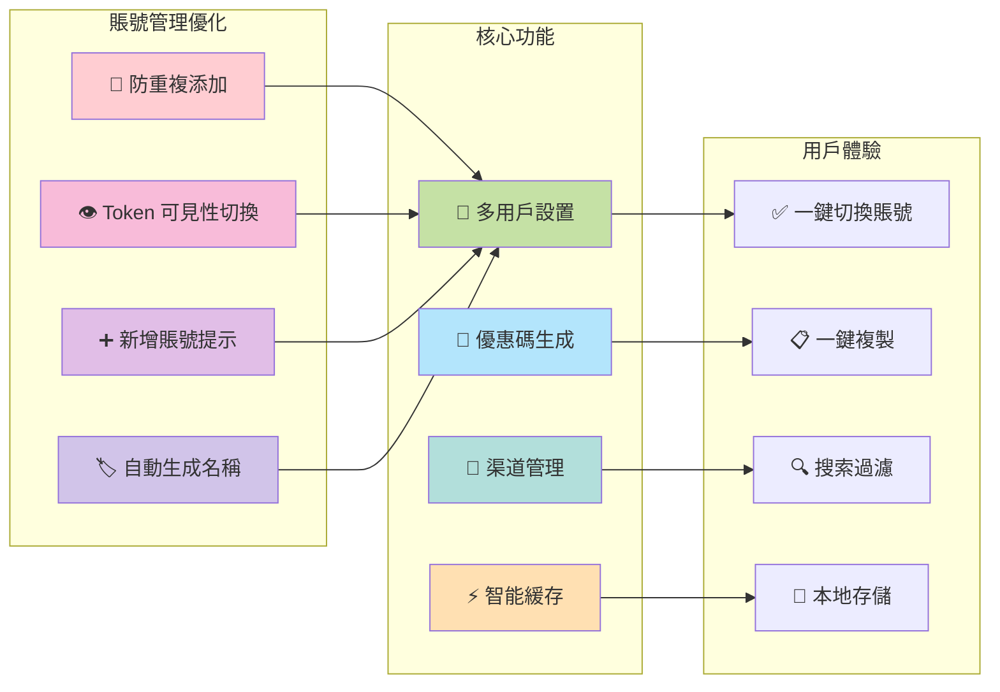

# 🚀 NewAPI Worker 工具

這是一個基於 Cloudflare Workers 的現代化 PWA 工具，採用兩欄式響應設計，提供完整的 NewAPI 管理解決方案。支持**多用戶賬號管理**、**渠道詳細查詢**和**優惠碼批量生成**功能。採用智能緩存機制和本地數據存儲，提供桌面級的安全用戶體驗。

<div align="center">


</div>

## 📑 目錄

- [🚀 NewAPI Worker 工具](#-newapi-worker-工具)
  - [📑 目錄](#-目錄)
  - [📋 部署指南](#-部署指南)
    - [🔧 部署到 Cloudflare Workers](#-部署到-cloudflare-workers)
    - [⚡ 快速部署方式](#-快速部署方式)
  - [📝 使用方法](#-使用方法)
    - [🌐 訪問工具](#-訪問工具)
    - [🔐 配置 NewAPI 憑證](#-配置-newapi-憑證)
    - [🔍 查詢渠道信息](#-查詢渠道信息)
  - [✨ 功能特色](#-功能特色)
    - [🛡️ 安全性](#️-安全性)
    - [🎨 使用體驗](#-使用體驗)
    - [📊 資料處理](#-資料處理)
    - [💾 離線功能](#-離線功能)
  - [🔄 更新記錄](#-更新記錄)
  - [⚠️ 注意事項](#️-注意事項)
  - [📄 許可證](#-許可證)

## 📋 部署指南

### 🔧 部署到 Cloudflare Workers

<details>
<summary>點擊展開詳細部署步驟</summary>

1. **📝 註冊 Cloudflare 帳號**
   - 如果尚未擁有 Cloudflare 帳號，請前往 [Cloudflare 官網](https://dash.cloudflare.com/sign-up) 註冊。

2. **⬇️ 安裝 Wrangler CLI 工具**
   - Wrangler 是 Cloudflare 官方提供的命令行工具，用於部署 Workers。
   - 使用 npm 安裝：
   ```bash
   npm install -g @cloudflare/wrangler
   ```

3. **🔑 登入 Wrangler**
   - 在終端機執行：
   ```bash
   wrangler login
   ```
   - 按照彈出的瀏覽器指示進行授權。

4. **📁 初始化項目**
   - 創建一個新資料夾並初始化項目：
   ```bash
   mkdir newapi-worker && cd newapi-worker
   wrangler init
   ```
   - 選擇「從頭開始」選項。

5. **⚙️ 配置 wrangler.toml**
   - 編輯生成的 `wrangler.toml` 文件，設定您的項目名稱：
   ```toml
   name = "newapi-worker"
   main = "worker.js"
   compatibility_date = "2023-06-28"
   
   [triggers]
   routes = [{ pattern = "你的域名", custom_domain = true }]
   ```
   - 如果不使用自定義域名，可以刪除 `[triggers]` 部分。

6. **📤 部署代碼**
   - 將本專案的 `worker.js` 檔案複製到您的項目資料夾中。
   - 執行部署命令：
   ```bash
   wrangler publish
   ```

7. **🔗 獲取 Worker 網址**
   - 部署成功後，終端機會顯示您的 Worker 訪問網址，通常格式為：
   ```
   https://newapi-worker.您的用戶名.workers.dev
   ```
   - 記錄此網址以便後續使用。

</details>

### ⚡ 快速部署方式

> 💡 **提示**：此方法適合快速試用，無需安裝任何工具。

<ol>
  <li>登入 <a href="https://dash.cloudflare.com/">Cloudflare Dashboard</a></li>
  <li>進入 "Workers & Pages" 部分</li>
  <li>點擊 "Create Application"</li>
  <li>選擇 "Create Worker"</li>
  <li>在編輯界面中，刪除所有默認代碼</li>
  <li>貼入本專案的 <code>worker.js</code> 內容</li>
  <li>點擊 "Save and Deploy"</li>
  <li>使用分配的網址訪問您的應用</li>
</ol>
## 📝 使用方法

### 🌐 訪問工具

1. 使用瀏覽器訪問您部署好的 Worker 網址。

### 🔐 配置 NewAPI 憑證

<table>
<tr>
<td>

**準備 NewAPI 憑證** 🗝️
- 您需要有效的 NewAPI URL 和 Access Token。
- 如果沒有這些資訊，請聯繫您的 NewAPI 管理員。
- 支持管理多個不同的 NewAPI 賬號。
  

</td>
<td>

**多用戶賬號管理** 👥

- 在界面的 "多用戶設定" 區塊中：
  - 賬號名稱：為賬號設置易識別的名稱（可留空自動生成）
  - API URL：輸入您的 NewAPI 完整 URL
  - Access Token：輸入您的 API 訪問令牌（可點擊👁️查看）
- 點擊「儲存賬號」按鈕保存到本地存儲
- 使用下拉選單快速切換不同賬號
  

</td>
</tr>
</table>


### 🔍 查詢渠道信息



1. **📋 獲取渠道列表**
   - 點擊「獲取渠道列表」按鈕，工具會從 API 獲取所有可用渠道。
   - 渠道列表會顯示在下拉選擇框中。

2. **🔎 搜索特定渠道**
   - 在搜索框中輸入渠道 ID 或名稱的一部分，可以立即過濾渠道列表。
   - 支持模糊搜索，只需輸入部分關鍵字即可。

3. **📊 查看渠道詳情**
   - 從列表中選擇一個渠道。
   - 點擊「獲取詳情」按鈕。
   - 渠道的詳細資訊會以表格形式顯示。

4. **📋 複製資訊**
   - 點擊表格中的任何值單元格可以直接複製該值到剪貼板。
   - 複製成功時會有視覺反饋和狀態提示。
   - 點擊「複製所有詳情」按鈕可以一次性複製所有渠道詳情為 JSON 格式。

### 🎫 生成優惠碼



1. **💰 設定生成參數**
   - 在「優惠碼生成」區塊中設定：
     - 額度（美金）：輸入優惠碼的面值，如 10 代表 10 美金
     - 數量：輸入要生成的優惠碼數量，如 5 個

2. **🎫 執行生成**
   - 點擊「生成優惠碼」按鈕
   - 系統會自動將美金轉換為 quota（1美金 = 500,000 quota）
   - 需要當前賬號具有優惠碼生成權限

3. **📋 獲取結果**
   - 生成結果會顯示在右側面板
   - 每個優惠碼單獨一行顯示
   - 點擊「複製所有優惠碼」可一次性複製所有結果
   - 可隨時返回渠道檢視模式

## ✨ 功能特色

### 🛡️ 安全性

- **🔒 本地資料存儲**：所有敏感憑證僅存儲在用戶的瀏覽器中，不在伺服器保存任何敏感資訊。
- **🔄 代理請求**：通過 Cloudflare Worker 代理 API 請求，避免跨域問題並提升安全性。
- **👁️ 敏感資訊保護**：Access Token 預設隱藏，可通過眼睛按鈕切換顯示。

### 👥 多用戶管理

- **🔄 智能賬號切換**：支持保存和管理多個 NewAPI 賬號，一鍵切換。
- **🏷️ 自動命名系統**：賬號名稱可留空，自動從 API URL 生成簡化名稱。
- **🔄 防重複機制**：根據 API URL 智能檢測，避免重複添加相同賬號。
- **💾 數據隔離**：每個賬號的數據獨立存儲，切換時自動載入對應緩存。

### 🎫 優惠碼生成

- **💰 美金額度設定**：直觀的美金單位輸入，系統自動轉換為 quota 值。
- **🔢 批量生成支持**：可設定數量，一次性生成多個優惠碼。
- **📋 智能結果展示**：生成結果分行顯示，支持一鍵複製所有優惠碼。
- **🔄 無縫模式切換**：在渠道查看和優惠碼生成間自由切換。

### 🎨 使用體驗

- **📱 響應式設計**：適應不同螢幕尺寸的裝置。
- **🧭 直觀操作**：清晰的界面和操作流程。
- **🔍 模糊搜索**：快速找到需要的渠道，支持 ID 和名稱搜索。
- **🖱️ 一鍵複製**：點擊表格中的任何值即可複製，無需選擇文本或使用額外按鈕。
- **✅ 視覺反饋**：複製操作提供明確的視覺反饋。

### 📊 資料處理

- **🧿 格式化顯示**：JSON 數據會被自動格式化，提高可讀性。
- **📚 大型列表支持**：能夠處理和搜索上千個渠道。
- **⚡ 即時過濾**：輸入關鍵字時立即過濾結果。
- **⚡ 智能緩存**：自動預緩存前10個渠道詳情，帶⚡標示的渠道載入更快。

### 💾 本地存儲

- **👥 多賬號持久化**：安全存儲多個賬號配置，重啟瀏覽器後自動恢復。
- **🔄 智能載入**：有憑證時自動載入渠道列表和預緩存數據。
- **🧹 靈活管理**：支持刪除單個賬號或清除所有存儲資料。

## 🔄 更新記錄

### v3.0.0 - 多用戶與優惠碼生成功能 (2024-12-20)

<details>
<summary><strong>🔧 多用戶設置系統</strong> - 點擊展開詳情</summary>

#### 👥 多賬號管理
- **🔄 智能賬號切換**：支持保存和管理多個 NewAPI 賬號
- **🏷️ 賬號命名系統**：為每個賬號設置自定義名稱，便於識別
- **💾 本地存儲優化**：重構存儲機制，支持多賬號數據管理
- **🔄 無縫切換**：一鍵在不同賬號間切換，自動載入對應數據

#### 🛡️ 賬號管理優化
- **🔄 防重複添加**：根據 API URL 智能檢測重複賬號，避免重複創建
- **👁️ Token 可見性切換**：眼睛按鈕快速切換 Access Token 顯示/隱藏
- **➕ 新增賬號提示**：空選項顯示為"新增賬號"，操作更直觀
- **🏷️ 自動生成名稱**：賬號名稱可留空，自動從 API URL 生成簡化名稱



</details>

<details>
<summary><strong>🎫 優惠碼生成系統</strong> - 點擊展開詳情</summary>

#### 💳 優惠碼生成功能
- **💰 美金額度設定**：以美金為單位設定優惠碼面值，自動轉換為系統 quota
- **🔢 批量生成**：可設定生成數量，一次性創建多個優惠碼
- **🎯 API 整合**：使用 `/api/redemption/` POST 接口生成優惠碼
- **📊 即時反饋**：生成過程中的進度提示和狀態顯示

#### 📋 結果展示與管理
- **📱 專屬顯示區域**：右側面板專門展示優惠碼生成結果
- **📝 分行顯示**：每個優惠碼單獨一行，清晰易讀
- **📋 一鍵複製**：支持複製所有優惠碼到剪貼板
- **🔙 模式切換**：在渠道檢視和優惠碼結果間自由切換

#### 🔢 智能轉換系統
- **💱 自動匯率**：1 美金 = 500,000 quota 的智能轉換
- **✅ 輸入驗證**：確保輸入的額度和數量合理有效
- **🛡️ 權限檢查**：需要當前賬號具有對應的生成權限

</details>

<details>
<summary><strong>🎨 界面體驗升級</strong> - 點擊展開詳情</summary>

#### 🖥️ 用戶界面改進
- **🎛️ 新增控制區塊**：專門的優惠碼生成區域設計
- **👁️ 互動元素增強**：眼睛按鈕的 hover 效果和視覺反饋
- **🔄 狀態管理優化**：更精確的操作狀態提示和錯誤處理
- **📱 響應式支持**：新功能完美適配各種設備尺寸

#### 🚀 性能與體驗
- **⚡ 智能緩存延續**：多賬號切換時的緩存管理優化
- **🔄 無縫切換體驗**：賬號切換時自動預緩存新賬號數據
- **💾 數據持久化**：多賬號數據的安全存儲與管理
- **🎯 操作流暢性**：優化的交互流程和反饋機制

</details>

### v2.0.0 - PWA風格重大更新 (2024-12-19)

<details>
<summary><strong>🎨 PWA風格UI重設計</strong> - 點擊展開詳情</summary>

#### 📐 布局架構革新
- **🖥️ 兩欄式布局**：針對桌面和筆電優化的左右分欄設計
  - **左側面板 (480px)**：API設定 + 渠道管理控制區
  - **右側面板 (響應式)**：專門的渠道詳情展示區域
- **📱 響應式設計**：平板和手機自動切換為垂直布局
- **🔍 智能適配**：根據屏幕尺寸自動調整界面元素

#### 🎨 視覺設計提升
- **🌈 現代化配色**：藍紫色漸變主題，提升視覺美感
- **🔤 字體優化**：採用系統字體棧 (-apple-system, BlinkMacSystemFont)
- **🎯 卡片式設計**：清晰的區塊劃分和層次結構
- **✨ 動畫效果**：淡入動畫、hover效果和狀態過渡

#### 📋 PWA功能支持
- **📱 PWA Meta標籤**：完整的漸進式Web應用配置
- **🎨 主題色彩**：統一的品牌配色方案
- **📲 應用圖標**：支持添加到主屏幕

</details>

<details>
<summary><strong>⚡ 智能緩存系統</strong> - 點擊展開詳情</summary>

#### 🧠 自動載入機制
- **🔄 智能啟動**：有憑證時自動獲取渠道列表
- **⚡ 預緩存技術**：自動預緩存前10個渠道的詳情數據
- **💾 本地存儲**：利用瀏覽器緩存提升載入速度
- **🔍 緩存標示**：⚡ 圖標標示已緩存的渠道

#### 📈 性能優化
- **🚀 秒速載入**：緩存渠道的詳情瞬間顯示
- **🌐 網絡優化**：減少不必要的API請求
- **⏱️ 智能延遲**：避免請求過於頻繁的保護機制

</details>

<details>
<summary><strong>🎯 用戶體驗革新</strong> - 點擊展開詳情</summary>

#### 🖱️ 交互體驗優化
- **👆 一鍵查看**：直接點擊渠道項目即可查看詳情，無需額外按鈕
- **🔍 實時搜索**：輸入時即時過濾，顯示匹配結果數量
- **📊 狀態反饋**：即時的狀態指示器和進度顯示
- **🎨 視覺提示**：hover效果和選中狀態的清晰標示

#### 🎛️ 界面控制增強
- **📝 表單優化**：更好的輸入框設計和焦點效果
- **🔘 按鈕升級**：漸變按鈕和禁用狀態的視覺反饋
- **📱 響應觸控**：觸控設備的優化體驗

#### 🎪 新增視覺元素
- **📋 空狀態設計**：美觀的佔位符和引導信息
- **❌ 錯誤狀態**：友好的錯誤提示界面
- **💡 智能提示**：操作指導和功能說明

</details>

<details>
<summary><strong>🔗 功能增強</strong> - 點擊展開詳情</summary>

#### 🌐 GitHub整合
- **🔗 項目連結**：右上角固定的GitHub圖標
- **🎨 動態效果**：hover縮放和陰影效果
- **📱 響應設計**：移動設備的圖標自適應

#### 💾 數據管理優化
- **🏷️ 緩存標識**：視覺化展示哪些渠道已預緩存
- **🔄 智能刷新**：保持數據新鮮度的機制
- **📊 狀態管理**：更精確的載入和錯誤狀態處理

#### 🎨 詳情展示增強
- **📋 表格美化**：更清晰的數據展示格式
- **📱 複製優化**：改進的複製功能和反饋
- **🎯 焦點管理**：更好的鍵盤導航支持

</details>

<details>
<summary><strong>🔧 技術架構優化</strong> - 點擊展開詳情</summary>

#### 💻 代碼結構改進
- **🧹 代碼重構**：模塊化的JavaScript代碼結構
- **🎯 DOM操作優化**：更高效的元素選擇和事件處理
- **🔄 狀態管理**：統一的應用狀態管理機制
- **📝 代碼可維護性**：清晰的函數命名和註釋

#### ⚡ 性能提升
- **🚀 載入速度**：優化的CSS和JavaScript載入
- **💾 內存管理**：更好的緩存策略和內存使用
- **🌐 網絡請求**：智能的API請求管理和錯誤處理
- **📱 移動端優化**：觸控設備的性能優化

#### 🛠️ 開發體驗
- **🔍 調試支持**：更好的錯誤信息和日誌
- **📊 狀態監控**：實時的狀態顯示和反饋
- **🔧 可擴展性**：易於添加新功能的架構設計

</details>

### v1.0.0 - 初始版本
- **🚀 基礎功能**：NewAPI渠道查詢工具
- **🔐 安全設計**：本地憑證存儲
- **🔍 搜索功能**：模糊搜索和過濾
- **📋 複製功能**：一鍵複製渠道資訊

---

## ⚠️ 注意事項

> ⚠️ **安全警告**：請妥善保管您的 API 憑證，不要在公共設備上存儲憑證。

<div style="background-color: #fff3cd; padding: 15px; border-radius: 4px; border-left: 4px solid #ffc107; margin-bottom: 15px;">
<strong>📌 功能限制</strong><br>
本工具僅提供查詢功能，不支持修改或刪除渠道資訊。
</div>

<div style="background-color: #d1ecf1; padding: 15px; border-radius: 4px; border-left: 4px solid #0dcaf0; margin-bottom: 15px;">
<strong>💡 提示</strong><br>
如遇到權限問題，請確認您的 Access Token 具有適當的權限。
</div>

---

<div align="center">
Made with ❤️ for better API management
</div> 

## 📄 許可證

本專案採用 [MIT 許可證](LICENSE)。你可以自由地使用、修改和分發此程式碼，包括商業用途，只需保留原始著作權聲明。

```
MIT License

Copyright (c) 2024 [123hi123]

Permission is hereby granted, free of charge, to any person obtaining a copy
of this software and associated documentation files (the "Software"), to deal
in the Software without restriction, including without limitation the rights
to use, copy, modify, merge, publish, distribute, sublicense, and/or sell
copies of the Software, and to permit persons to whom the Software is
furnished to do so, subject to the following conditions:

The above copyright notice and this permission notice shall be included in all
copies or substantial portions of the Software.

THE SOFTWARE IS PROVIDED "AS IS", WITHOUT WARRANTY OF ANY KIND, EXPRESS OR
IMPLIED, INCLUDING BUT NOT LIMITED TO THE WARRANTIES OF MERCHANTABILITY,
FITNESS FOR A PARTICULAR PURPOSE AND NONINFRINGEMENT. IN NO EVENT SHALL THE
AUTHORS OR COPYRIGHT HOLDERS BE LIABLE FOR ANY CLAIM, DAMAGES OR OTHER
LIABILITY, WHETHER IN AN ACTION OF CONTRACT, TORT OR OTHERWISE, ARISING FROM,
OUT OF OR IN CONNECTION WITH THE SOFTWARE OR THE USE OR OTHER DEALINGS IN THE
SOFTWARE.
```
