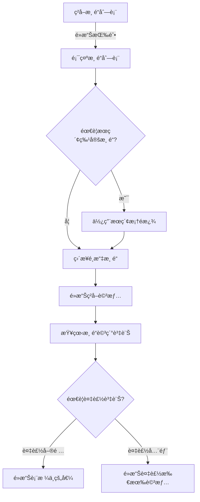

# 🚀 NewAPI Worker 工具

這是一個基於 Cloudflare Workers 的工具，用於安全地æ“作 NewAPI，特別是查詢渠é“詳細資訊。所有æ•æ„Ÿæ†‘證資料都僅ä¿å­˜åœ¨ä½¿ç”¨è€…çš„ç€è¦½å™¨æœ¬åœ°å­˜å„²ä¸­ï¼Œç¢ºä¿è³‡æ–™å®‰å…¨æ€§ã€‚

<div align="center">


</div>

## 📑 目錄

- [🚀 NewAPI Worker 工具](#-newapi-worker-工具)
  - [📑 目錄](#-目錄)
  - [📋 部署指å—](#-部署指å—)
    - [🔧 部署到 Cloudflare Workers](#-部署到-cloudflare-workers)
    - [âš¡ 快速部署方å¼](#-快速部署方å¼)
  - [📠使用方法](#-使用方法)
    - [🌠訪å•å·¥å…·](#-訪å•å·¥å…·)
    - [🔠é…ç½® NewAPI 憑證](#-é…ç½®-newapi-憑證)
    - [🔠查詢渠é“ä¿¡æ¯](#-查詢渠é“ä¿¡æ¯)
  - [✨ 功能特色](#-功能特色)
    - [ğŸ›¡ï¸ å®‰å…¨æ€§](#ï¸-安全性)
    - [🨠使用體驗](#-使用體驗)
    - [📊 資料處ç†](#-資料處ç†)
    - [💾 離線功能](#-離線功能)
  - [âš ï¸ æ³¨æ„事項](#ï¸-注æ„事項)

## 📋 部署指å—

### 🔧 部署到 Cloudflare Workers

<details>
<summary>é»æ“Šå±•é–‹è©³ç´°éƒ¨ç½²æ­¥é©Ÿ</summary>

1. **📠註冊 Cloudflare 帳號**
   - 如æœå°šæœªæ“有 Cloudflare 帳號，請å‰å¾€ [Cloudflare 官網](https://dash.cloudflare.com/sign-up) 註冊。

2. **â¬‡ï¸ å®‰è£ Wrangler CLI 工具**
   - Wrangler 是 Cloudflare 官方æ供的命令行工具，用於部署 Workers。
   - 使用 npm 安è£ï¼š
   ```bash
   npm install -g @cloudflare/wrangler
   ```

3. **🔑 登入 Wrangler**
   - 在終端機執行：
   ```bash
   wrangler login
   ```
   - 按照彈出的ç€è¦½å™¨æŒ‡ç¤ºé€²è¡Œæˆæ¬Šã€‚

4. **📠åˆå§‹åŒ–é …ç›®**
   - 創建一個新資料夾並åˆå§‹åŒ–項目：
   ```bash
   mkdir newapi-worker && cd newapi-worker
   wrangler init
   ```
   - é¸æ“‡ã€Œå¾é ­é–‹å§‹ã€é¸é …。

5. **âš™ï¸ é…ç½® wrangler.toml**
   - 編輯生æˆçš„ `wrangler.toml` 文件，設定您的項目å稱：
   ```toml
   name = "newapi-worker"
   main = "worker.js"
   compatibility_date = "2023-06-28"

   [triggers]
   routes = [{ pattern = "你的域å", custom_domain = true }]
   ```
   - 如æœä¸ä½¿ç”¨è‡ªå®šç¾©åŸŸå，å¯ä»¥åˆªé™¤ `[triggers]` 部分。

6. **📤 部署代碼**
   - 將本專案的 `worker.js` 檔案複製到您的項目資料夾中。
   - 執行部署命令：
   ```bash
   wrangler publish
   ```

7. **🔗 ç²å– Worker 網å€**
   - 部署æˆåŠŸå¾Œï¼Œçµ‚端機會顯示您的 Worker 訪å•ç¶²å€ï¼Œé€šå¸¸æ ¼å¼ç‚ºï¼š
   ```
   https://newapi-worker.您的用戶å.workers.dev
   ```
   - 記錄此網å€ä»¥ä¾¿å¾ŒçºŒä½¿ç”¨ã€‚

</details>

### âš¡ 快速部署方å¼

> 💡 **æ示**：此方法é©åˆå¿«é€Ÿè©¦ç”¨ï¼Œç„¡éœ€å®‰è£ä»»ä½•å·¥å…·ã€‚

<ol>
  <li>登入 <a href="https://dash.cloudflare.com/">Cloudflare Dashboard</a></li>
  <li>進入 "Workers & Pages" 部分</li>
  <li>é»æ“Š "Create Application"</li>
  <li>é¸æ“‡ "Create Worker"</li>
  <li>在編輯界é¢ä¸­ï¼Œåˆªé™¤æ‰€æœ‰é»˜èªä»£ç¢¼</li>
  <li>貼入本專案的 <code>worker.js</code> 內容</li>
  <li>é»æ“Š "Save and Deploy"</li>
  <li>使用分é…的網å€è¨ªå•æ‚¨çš„應用</li>
</ol>


## 📠使用方法

### 🌠訪å•å·¥å…·

1. 使用ç€è¦½å™¨è¨ªå•æ‚¨éƒ¨ç½²å¥½çš„ Worker 網å€ã€‚

### 🔠é…ç½® NewAPI 憑證

<table>
<tr>
<td>
  
**準備 NewAPI 憑證** ğŸ—ï¸
- 您需è¦æœ‰æ•ˆçš„ NewAPI URL å’Œ Access Token。
- 如æœæ²’有這些資訊，請è¯ç¹«æ‚¨çš„ NewAPI 管ç†å“¡ã€‚
  
</td>
<td>
  
**在工具中填入憑證** ğŸ“
- 在界é¢çš„ "API 設定" å€å¡Šä¸­ï¼š
  - API URL：輸入您的 NewAPI 完整 URL
  - Access Token：輸入您的 API 訪å•ä»¤ç‰Œ
- é»æ“Šã€Œå„²å­˜æ†‘è­‰ã€æŒ‰éˆ•ä¿å­˜åˆ°æœ¬åœ°å­˜å„²
  
</td>
</tr>
</table>

### 🔠查詢渠é“ä¿¡æ¯


```mermaid
graph TD
    A[ç²å–渠é“列表] -->|é»æ“ŠæŒ‰éˆ•| B[顯示渠é“列表]
    B --> C{需è¦æœç´¢ç‰¹å®šæ¸ é“?}
    C -->|是| D[使用æœç´¢æ¡†é濾]
    C -->|å¦| E[ç›´æ¥é¸æ“‡æ¸ é“]
    D --> E
    E --> F[é»æ“Šç²å–詳情]
    F --> G[查看渠é“詳細資訊]
    G --> H{需è¦è¤‡è£½è³‡è¨Š?}
    H -->|複製單項| I[é»æ“Šè¡¨æ ¼ä¸­çš„值]
    H -->|複製全部| J[é»æ“Šè¤‡è£½æ‰€æœ‰è©³æƒ…]
```

1. **📋 ç²å–渠é“列表**
   - é»æ“Šã€Œç²å–渠é“列表ã€æŒ‰éˆ•ï¼Œå·¥å…·æœƒå¾ API ç²å–所有å¯ç”¨æ¸ é“。
   - 渠é“列表會顯示在下拉é¸æ“‡æ¡†ä¸­ã€‚

2. **🔠æœç´¢ç‰¹å®šæ¸ é“**
   - 在æœç´¢æ¡†ä¸­è¼¸å…¥æ¸ é“ ID 或å稱的一部分，å¯ä»¥ç«‹å³é濾渠é“列表。
   - 支æŒæ¨¡ç³Šæœç´¢ï¼Œåªéœ€è¼¸å…¥éƒ¨åˆ†é—œéµå­—å³å¯ã€‚

3. **📊 查看渠é“詳情**
   - å¾åˆ—表中é¸æ“‡ä¸€å€‹æ¸ é“。
   - é»æ“Šã€Œç²å–詳情ã€æŒ‰éˆ•ã€‚
   - 渠é“的詳細資訊會以表格形å¼é¡¯ç¤ºã€‚

4. **📋 複製資訊**
   - é»æ“Šè¡¨æ ¼ä¸­çš„任何值單元格å¯ä»¥ç›´æ¥è¤‡è£½è©²å€¼åˆ°å‰ªè²¼æ¿ã€‚
   - 複製æˆåŠŸæ™‚會有視覺å饋和狀態æ示。
   - é»æ“Šã€Œè¤‡è£½æ‰€æœ‰è©³æƒ…ã€æŒ‰éˆ•å¯ä»¥ä¸€æ¬¡æ€§è¤‡è£½æ‰€æœ‰æ¸ é“詳情為 JSON æ ¼å¼ã€‚

## ✨ 功能特色

### ğŸ›¡ï¸ å®‰å…¨æ€§

- **🔒 本地資料存儲**：所有æ•æ„Ÿæ†‘證僅存儲在用戶的ç€è¦½å™¨ä¸­ï¼Œä¸åœ¨ä¼ºæœå™¨ä¿å­˜ä»»ä½•æ•æ„Ÿè³‡è¨Šã€‚
- **🔄 代ç†è«‹æ±‚**：通é Cloudflare Worker ä»£ç† API 請求，é¿å…跨域å•é¡Œä¸¦æå‡å®‰å…¨æ€§ã€‚

### 🨠使用體驗

- **📱 響應å¼è¨­è¨ˆ**：é©æ‡‰ä¸åŒè¢å¹•å°ºå¯¸çš„è£ç½®ã€‚
- **🧭 直觀æ“作**：清晰的界é¢å’Œæ“作æµç¨‹ã€‚
- **🔠模糊æœç´¢**：快速找到需è¦çš„渠é“ï¼Œæ”¯æŒ ID å’Œå稱æœç´¢ã€‚
- **ğŸ–±ï¸ ä¸€éµè¤‡è£½**：é»æ“Šè¡¨æ ¼ä¸­çš„任何值å³å¯è¤‡è£½ï¼Œç„¡éœ€é¸æ“‡æ–‡æœ¬æˆ–使用é¡å¤–按鈕。
- **✅ 視覺å饋**：複製æ“作æä¾›æ˜ç¢ºçš„視覺å饋。

### 📊 資料處ç†

- **🧿 æ ¼å¼åŒ–顯示**：JSON 數據會被自動格å¼åŒ–，æ高å¯è®€æ€§ã€‚
- **📚 大å‹åˆ—表支æŒ**：能夠處ç†å’Œæœç´¢ä¸Šåƒå€‹æ¸ é“。
- **âš¡ å³æ™‚é濾**：輸入關éµå­—時立å³é濾çµæœã€‚

### 💾 離線功能

- **💡 憑證記憶**：å¯é¸æ“‡å°‡æ†‘è­‰ä¿å­˜åœ¨æœ¬åœ°ï¼Œä¸‹æ¬¡è¨ªå•è‡ªå‹•å¡«å……。
- **🧹 清除憑證**：æ供簡單的方å¼æ¸…除ä¿å­˜çš„憑證。

---

## âš ï¸ æ³¨æ„事項

> âš ï¸ **安全警告**：請妥善ä¿ç®¡æ‚¨çš„ API 憑證，ä¸è¦åœ¨å…¬å…±è¨­å‚™ä¸Šå­˜å„²æ†‘證。

<div style="background-color: #fff3cd; padding: 15px; border-radius: 4px; border-left: 4px solid #ffc107; margin-bottom: 15px;">
<strong>📌 功能é™åˆ¶</strong><br>
本工具僅æ供查詢功能，ä¸æ”¯æŒä¿®æ”¹æˆ–刪除渠é“資訊。
</div>

<div style="background-color: #d1ecf1; padding: 15px; border-radius: 4px; border-left: 4px solid #0dcaf0; margin-bottom: 15px;">
<strong>💡 æ示</strong><br>
如é‡åˆ°æ¬Šé™å•é¡Œï¼Œè«‹ç¢ºèªæ‚¨çš„ Access Token 具有é©ç•¶çš„權é™ã€‚
</div>

---

<div align="center">
Made with â¤ï¸ for better API management
</div> 